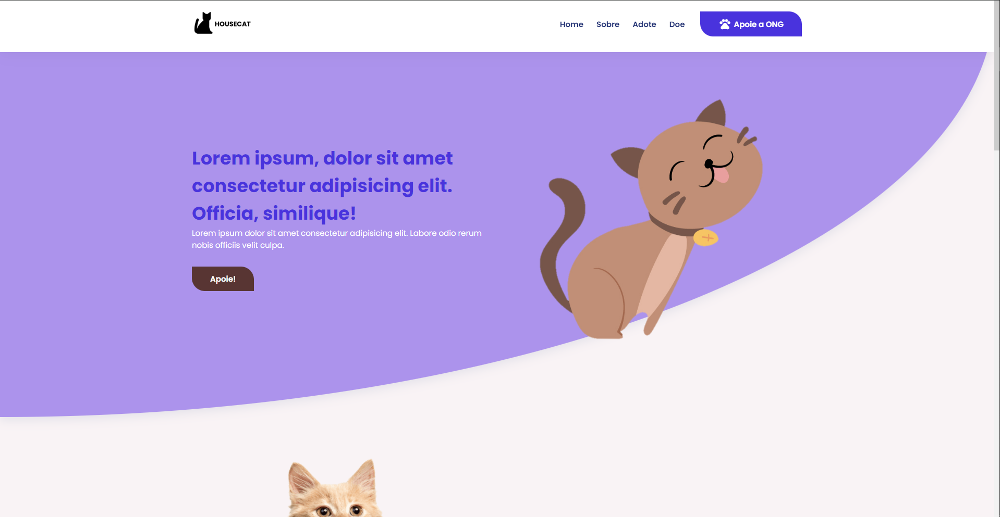

<h1 align="center" style="color: #805ad5; font-weight: bold;">HouseCat 🐈</h1>

<b>HouseCat é um projeto desenvolvido para uma ONG com o objetivo de divulgar os gatos abandonados que estão para adoção,
aumentar o número de arrecadações e, principalmente, arranjar um lar para os nossos felinos.</b>

<b>Veja o site em diferentes tipos de aparelhos!</b>

  <b>Desktop & Mobile</b>
  
https://github.com/user-attachments/assets/487fd685-93a5-4c20-be53-7bd817bc46b9

  

<h2>Tecnologias</h2>

### HTML, Sass & JavaScript:
Foi usado <b>HTML</b> para realizar a estrutura do projeto, <b>Sass</b> para estilização e <b>JavaScript</b> para validação de formulário, envio de e-mail e interatividade da aplicação.

  <b>Envio de e-mail</b>
  

  
