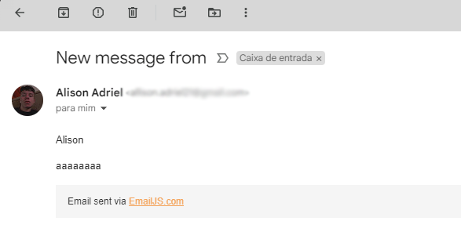

 ## [HouseCat 🐈 ](https://housecat-zeta.vercel.app/)

<b>HouseCat é um projeto desenvolvido para uma ONG com o objetivo de divulgar os gatos abandonados que estão para adoção,
aumentar o número de arrecadações e, principalmente, arranjar um lar para os nossos felinos.</b>

 <b>Veja o site em diferentes tipos de aparelhos!</b>  
  <b> 💻 Desktop & Mobile</b>
  

 

https://github.com/user-attachments/assets/4fd11c52-3888-435d-a2c3-f988d03c9069

https://github.com/user-attachments/assets/ca7dc245-70c0-4c3a-86b0-ec0a03bc4606

 

<h2> 🛠️ Tecnologias</h2>

### HTML, Sass & JavaScript:
Foi usado <b>HTML</b> para realizar a estrutura do projeto, <b>Sass</b> para estilização e <b>JavaScript</b> para validação de formulário, envio de e-mail e interatividade da aplicação.

  <b>Envio de e-mail</b>
  

<h2> 🔜 Futuro do Projeto</h2>

### O que será adicionado futuramente ao projeto?
Pretendo futuramente adicionar um painel ADMIN onde o dono da ONG possa publicar fotos dos gatos que estão disponíveis para a adoção juntamente com a descrição do felino.
Dessa forma, ficará mais fácil e intuitivo o processo de adoção e manutenção do site.

## 👋 Obrigado pela leitura e abaixo está o link para contato.

[LinkedIn 💬](https://www.linkedin.com/in/alisonadriel/)

